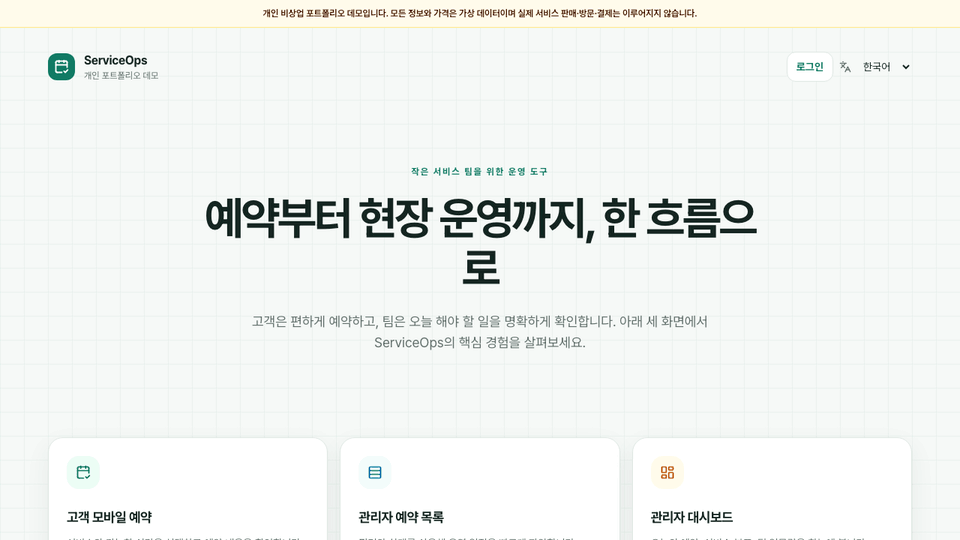
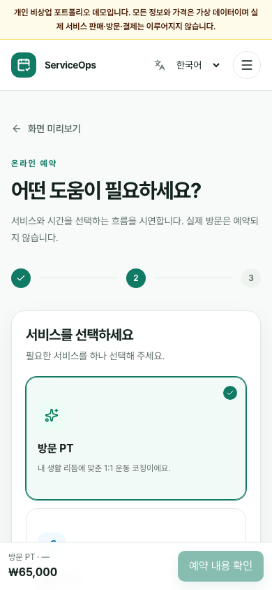
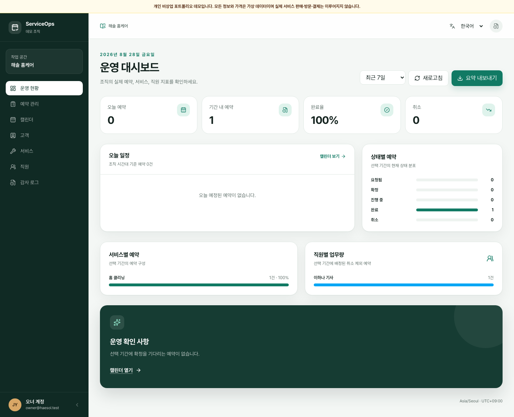
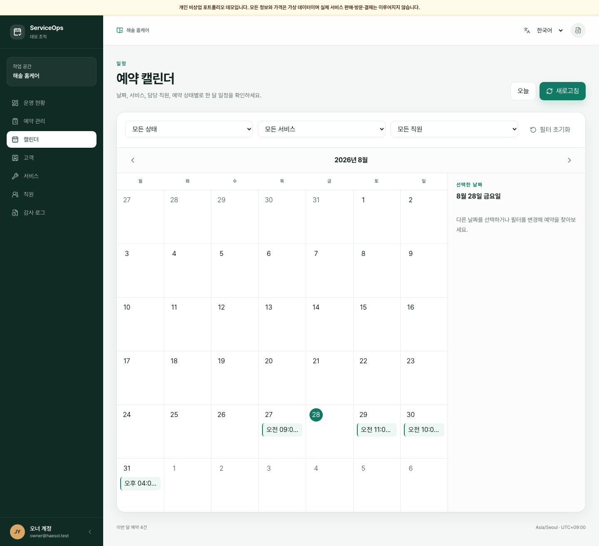
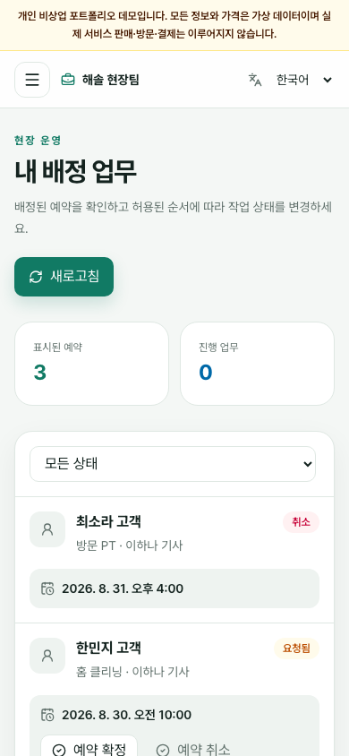
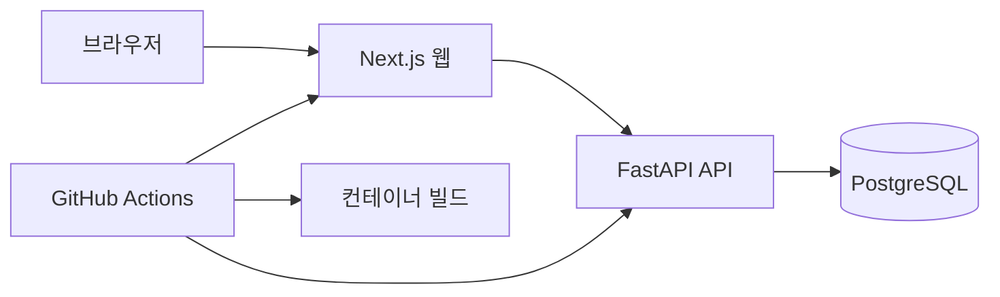

# ServiceOps

[English](README.md) | **한국어**

ServiceOps는 소규모 현장 서비스 팀을 위한 웹 기반 예약·운영 플랫폼을 구현한 개인 비상업 포트폴리오 데모입니다. 고객의 서비스 예약, 직원의 배정 업무 관리, 오너의 일정·인력·리포트·감사 이력 관리를 하나의 조직 단위 시스템으로 보여줍니다.

> **현재 상태:** 로컬 제품 흐름과 Milestone 5 포트폴리오 정리를 완료했습니다. clean checkout, 백엔드 테스트 21개, 격리된 Playwright 흐름 12개, 영문·한글 스크린샷과 데모 GIF를 검증했습니다. 릴리스 전에는 사람을 통한 스크린리더·실기기 검토, 승인된 무료 배포 검증, 오너 예약 결과 페이지네이션 결정, MVP 릴리스 태그가 남아 있습니다.

## 구현된 경로

- 고객 모바일 예약: `/ko/booking`, `/en/booking`
- 오너 예약 목록: `/ko/owner/bookings`, `/en/owner/bookings`
- 직원 배정 업무: `/ko/staff/bookings`, `/en/staff/bookings`
- 오너 고객·직원·감사 로그: `/ko/owner/customers`, `/ko/owner/team`, `/ko/owner/audit` 및 동일한 `/en` 경로
- 오너 대시보드: `/ko/owner/dashboard`, `/en/owner/dashboard`
- 오너 캘린더: `/ko/owner/calendar`, `/en/owner/calendar`
- 오너 서비스 관리: `/ko/owner/services`, `/en/owner/services`
- 인증: `/ko/login`, `/en/login`
- FastAPI 문서: `/docs`
- API 생존 확인: `/health`
- API 준비 상태: `/ready`

화면에 표시되는 이름, 이메일, 일정, 지표, 가격은 모두 `make seed`로 저장되는 가상 데모 데이터입니다. 실제 서비스를 판매하거나 제공하지 않으며 결제를 받거나 수집하지 않습니다.

## 제품 화면



| 고객 예약                                                                 | 오너 운영 대시보드                                                          |
| ------------------------------------------------------------------------- | --------------------------------------------------------------------------- |
|  |  |

| 오너 캘린더                                                         | 직원 배정 업무                                                          |
| ------------------------------------------------------------------- | ----------------------------------------------------------------------- |
|  |  |

제품 문제, 아키텍처, 구현 트레이드오프, 보안 결정, 테스트 전략은 [ServiceOps 사례 연구](docs/case-study.md)에서 확인할 수 있습니다.

## 아키텍처



저장소는 단순한 모노레포 구조입니다. 하나의 Next.js 애플리케이션이 공개·고객·직원·오너 화면을 포함합니다. FastAPI는 인증, 권한, 테넌시, 예약 규칙의 기준이며 PostgreSQL은 Docker Compose로 로컬에서 실행됩니다. 무료 공개 데모의 임시 후보 구성은 웹/API용 Vercel Hobby와 관리형 PostgreSQL용 Supabase Free이며, 아직 실제 배포하거나 검증하지 않았습니다.

자세한 내용은 [아키텍처 문서](docs/architecture.md)와 [ADR](docs/adr/)에서 확인할 수 있습니다.

## 기술 기준

| 영역         | 기술                                                                        |
| ------------ | --------------------------------------------------------------------------- |
| 웹           | Next.js 16.3.3, React 19.2.8, TypeScript 6.0.3                              |
| UI           | Tailwind CSS 4.3.3, Lucide React 1.34.0, Pretendard 1.3.9                   |
| 다국어       | next-intl 4.14.0, 한국어 기본, 영어 지원                                    |
| API          | Python 3.12, FastAPI 0.141.1, SQLAlchemy 2.0.52, Alembic 1.19.1             |
| 데이터베이스 | PostgreSQL 17.11                                                            |
| 도구         | pnpm 11.19.0, Playwright 1.62.1, axe-core 4.13.0, Ruff 0.16.5, pytest 9.1.1 |
| 실행 환경    | Docker Compose, GitHub Actions                                              |

JavaScript와 Python의 정확한 전이 의존성 버전은 `pnpm-lock.yaml`과 `apps/api/uv.lock`에 기록되어 있습니다.

## 로컬 설치

필수 도구:

- Docker Compose를 포함한 Docker Desktop
- Node.js 22와 Corepack
- 호스트에서 API를 개발할 때 사용할 Python 3.12와 `uv`

저장소에 고정된 pnpm 버전을 활성화하고 환경 파일과 의존성을 준비합니다.

```bash
corepack enable
cp .env.example .env
make setup
```

`.env`의 PostgreSQL 임시 비밀번호를 로컬 전용 비밀번호로 교체하세요. 이 파일은 커밋하면 안 됩니다.

전체 컨테이너 스택을 시작합니다.

```bash
make start
make seed
```

접속 주소:

- 웹: <http://localhost:3000>
- API 문서: <http://localhost:8000/docs>
- API 상태: <http://localhost:8000/health>

로컬 데이터베이스 볼륨을 삭제하지 않고 컨테이너를 중지합니다.

```bash
make stop
```

macOS에서 UI를 빠르게 개발하려면 PostgreSQL만 Docker로 시작하고 애플리케이션을 별도 터미널에서 실행할 수 있습니다.

```bash
docker compose up -d postgres
make dev-api
make dev-web
```

## 품질 검증 명령

```bash
make lint
make type-check
make test
make build
make e2e
```

`make start`는 API 실행 전에 대기 중인 Alembic 마이그레이션을 적용합니다. `make migrate`로 명시적으로 적용할 수도 있으며, `make seed`는 가상 계정·서비스·직원 가용 시간·휴무·예약을 생성합니다. 로컬 데모 계정은 오너 `owner@serviceops.test`, 직원 `staff.hana@serviceops.test`, 고객 `customer.sora@serviceops.test`이며 비밀번호는 모두 `ServiceOps-Demo-2026!`입니다. 이는 로컬 seed 전용 자격 증명입니다. 공개 배포에서는 별도로 생성하고 초기화할 수 있는 가상 계정을 사용해야 하며 이 비밀번호를 배포 기본값으로 활성화하면 안 됩니다.

`make e2e`는 격리된 `serviceops-e2e` Docker 프로젝트를 시작하고 seed 데이터를 생성한 다음 고객 가입·예약, 직원 상태 변경, 고객 취소, 오너 서비스 생성·예약 필터, 오너 권한 격리, 모바일 영문 현지화·오버플로 검사를 Chromium에서 실행합니다. 성공하거나 실패하면 임시 데이터베이스 볼륨을 제거하므로 개발 데이터베이스를 변경하지 않습니다.

`make test`는 Docker가 `postgres-test`에 실제로 공개한 호스트 포트로 연결합니다. `.env` 또는 단일 명령에서 `TEST_POSTGRES_PORT`를 변경해도 별도의 데이터베이스 URL을 지정할 필요가 없습니다. 테스트 컨테이너는 성공·중단·실패 후 모두 정지합니다.

GitHub Actions는 저장소 secret 없이 프런트엔드 포맷, 린트, 엄격한 타입 검사, 백엔드 테스트, 프로덕션 웹 빌드, 컨테이너 빌드, 핵심 Playwright 흐름을 실행합니다.

다국어 포트폴리오 자산은 격리된 seed Docker 프로젝트에서 재현할 수 있습니다. `make portfolio-captures`와 `make portfolio-captures-ko`는 각각 영문·한글 스크린샷을 갱신합니다. `make portfolio-demo`와 `make portfolio-demo-ko`는 각 언어 GIF를 갱신하며 ImageMagick이 추가로 필요합니다. 모든 명령은 종료할 때 임시 데이터베이스 볼륨을 제거합니다.

## 저장소 구조

```text
apps/
├── web/                 # Next.js 다국어 제품 화면
└── api/                 # FastAPI 애플리케이션과 테스트
packages/
└── tokens/              # 공유 시맨틱 디자인 토큰
docs/
├── adr/                 # 아키텍처 결정 기록
├── accessibility.md
├── manual-accessibility-review.md
├── architecture.md
├── api.md
├── case-study.md
├── security.md
└── design-spike.md
infra/docker/            # 웹·API Dockerfile
.github/workflows/       # CI 품질 게이트
docker-compose.yml
Makefile
README.md
README.ko.md
```

## 보안 참고 사항

- 실제 고객·결제·개인 데이터를 사용하지 않습니다.
- 프로젝트와 향후 공개 사이트는 개인 비상업 소프트웨어 데모이며 실제 서비스를 광고하거나 제공하지 않습니다.
- 로컬 포트는 기본적으로 `127.0.0.1`에만 바인딩됩니다.
- secret은 무시되는 `.env` 파일에만 저장하며 `.env.example`에는 자리표시자만 포함합니다.
- 접근·갱신 자격 증명은 불투명한 HttpOnly 쿠키이며 PostgreSQL에는 SHA-256 해시만 저장합니다.
- 쿠키 기반 변경 요청은 출처 허용 목록과 CSRF 쿠키/헤더 바인딩으로 보호합니다. HTTPS 배포에서는 `COOKIE_SECURE=true`를 설정해야 합니다.
- 여러 API 인스턴스로 배포하기 전에 프로세스 로컬 로그인 제한기를 공유 인프라로 교체하거나 보완해야 합니다.
- 대시보드, 캘린더, 고객 예약, 오너 운영, 직원 배정 업무 화면은 조직·권한 범위를 적용한 API를 사용하며 seed 계정과 활동은 모두 가상 데이터입니다.
- 공개 배포는 아직 생성하지 않았습니다. 배포와 외부 계정 생성에는 명시적 승인이 필요합니다.

## 범위와 제외 사항

MVP에는 고객·직원·오너 역할, 서비스와 가용 시간 관리, 충돌 방지 예약, 운영 리포트, CSV 내보내기, 감사 로그, 결정적 데모 데이터, 자동화 테스트, 공개 문서가 포함됩니다.

실제 결제·고객 데이터, 채팅, 제품 내 AI 기능, 회계, 급여, 청구, 네이티브 모바일 앱, 복잡한 경로·반복 예약, 타사 OAuth, SMS 전송, 승인되지 않은 유료 인프라는 의도적으로 제외합니다.

## 주요 결정과 트레이드오프

- 하나의 모노레포에서 프런트엔드, 백엔드, 공유 토큰, CI, 문서를 함께 검토합니다.
- 하나의 디자인 시스템으로 여유 있는 고객 화면과 밀도 높은 운영 화면을 지원합니다.
- 로케일 접두 경로를 사용해 향후 기본 언어를 한국어에서 영어로 예측 가능하게 변경할 수 있습니다.
- 생성형 데이터베이스 API에 위임하지 않고 FastAPI가 비즈니스 규칙과 권한을 담당합니다.
- 호스팅 제공자의 편의성보다 로컬 Docker 재현성을 우선합니다.
- 검증된 Webpack 프로덕션 빌드를 저장소 품질 게이트로 사용합니다. 환경별 CSS 워커 제약이 있는 Turbopack은 MVP 이후 선택적으로 재검토합니다.

## 두 장소 작업 방식

공개 [GitHub 저장소](https://github.com/dong0277/serviceops)가 두 작업 장소 사이의 동기화 기준입니다. 장소를 옮기기 전 현재 브랜치를 커밋하고 푸시합니다. 로컬 stash, `.env`, 의존성, Docker 볼륨은 컴퓨터 사이에서 이동하지 않으며 추적된 lockfile, 마이그레이션, seed 명령, 설치 문서로 다시 생성합니다.

## 로드맵

1. VoiceOver와 두 번째 스크린리더 청취 검토 및 실기기 사용성 확인
2. 오너 예약 페이지네이션을 MVP에 구현할지 명시적으로 연기할지 결정
3. 승인된 무료 공개 배포 및 쿠키·CORS·CSRF·도메인·속도 제한 최종 검증
4. 모든 인수 조건 통과 후 MVP 릴리스 태그 생성
5. 검증된 범용 프로젝트 패턴을 MVP 이후 별도 추출

## 라이선스

[MIT](LICENSE)
