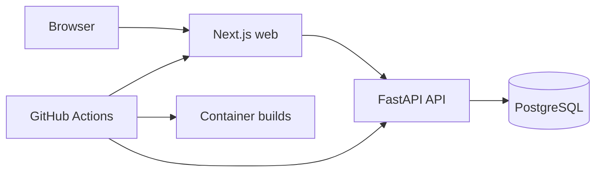

# ServiceOps

ServiceOps is a web-based booking and operations platform for small field-service teams. It is being built as a production-quality public portfolio project: customers book available services, staff manage assigned work, and owners oversee schedules, people, reporting, and audit history from one organization-scoped system.

> **Current status:** Milestone 3 complete. Staff assigned-work and status transitions, owner booking operations, customer and team directories, organization-scoped audit logs, and formula-safe filtered CSV export are implemented on top of the conflict-safe booking domain.

## Current preview

- Customer mobile booking: `/ko/booking` and `/en/booking`
- Owner booking list: `/ko/owner/bookings` and `/en/owner/bookings`
- Staff assigned work: `/ko/staff/bookings` and `/en/staff/bookings`
- Owner customers, team, and audit log: `/ko/owner/customers`, `/ko/owner/team`, and `/ko/owner/audit` with equivalent `/en` routes
- Owner dashboard: `/ko/owner/dashboard` and `/en/owner/dashboard`
- Authentication: `/ko/login` and `/en/login`
- FastAPI docs: `/docs`
- API liveness: `/health`
- API readiness: `/ready`

All displayed names, email addresses, schedules, metrics, and prices are fictional demo data persisted by `make seed`. The displayed prices are non-billing information and no payment is collected.

## Architecture



The repository is a simple monorepo. A single Next.js application contains public, customer, staff, and owner surfaces. FastAPI remains the authority for authentication, authorization, tenancy, and booking rules. PostgreSQL runs locally through Docker Compose and may later use Supabase as a managed database only.

See [architecture notes](docs/architecture.md) and the [architecture decisions](docs/adr/) for details.

## Technology baseline

| Area         | Technology                                                       |
| ------------ | ---------------------------------------------------------------- |
| Web          | Next.js 16.3.3, React 19.2.8, TypeScript 6.0.3                   |
| UI           | Tailwind CSS 4.3.3, Lucide React 1.34.0, Pretendard 1.3.9        |
| Localization | next-intl 4.14.0; Korean default, English supported              |
| API          | Python 3.12, FastAPI 0.141.1, SQLAlchemy 2.0.52, Alembic 1.19.1  |
| Database     | PostgreSQL 17.11                                                 |
| Tooling      | pnpm 11.19.0, uv 0.12.7 in containers, Ruff 0.16.5, pytest 9.1.1 |
| Runtime      | Docker Compose and GitHub Actions                                |

Exact JavaScript and Python transitive versions are recorded in `pnpm-lock.yaml` and `apps/api/uv.lock`.

## Local setup

Prerequisites:

- Docker Desktop with Docker Compose
- Node.js 22 and Corepack
- Python 3.12 and `uv` for host-side API development

Enable the repository-pinned pnpm version, prepare the environment file, and install dependencies:

```bash
corepack enable
cp .env.example .env
make setup
```

Replace the placeholder PostgreSQL password in `.env`. Never commit that file.

Start the complete container stack:

```bash
make start
make seed
```

Open:

- Web: <http://localhost:3000>
- API docs: <http://localhost:8000/docs>
- API health: <http://localhost:8000/health>

Stop containers without deleting the local database volume:

```bash
make stop
```

For faster UI iteration on macOS, start only PostgreSQL in Docker and run the applications on the host in separate terminals:

```bash
docker compose up -d postgres
make dev-api
make dev-web
```

## Quality commands

```bash
make lint
make type-check
make test
make build
```

`make start` runs pending Alembic migrations before the API starts. `make migrate` can apply them explicitly, and `make seed` creates deterministic fictional identities, services, staff availability, time off, and bookings. The local demo owner is `owner@serviceops.test`, staff is `staff.hana@serviceops.test`, and customer is `customer.sora@serviceops.test`. All use password `ServiceOps-Demo-2026!`; never use these credentials outside local development.

GitHub Actions runs frontend formatting, lint, strict type checking, backend tests, a production web build, and container builds without repository secrets.

## Repository structure

```text
apps/
├── web/                 # Next.js localized product surfaces
└── api/                 # FastAPI application and tests
packages/
└── tokens/              # Shared semantic design tokens
docs/
├── adr/                 # Architecture decision records
├── architecture.md
├── api.md
├── security.md
└── design-spike.md
infra/docker/            # Web and API Dockerfiles
.github/workflows/       # CI quality gates
docker-compose.yml
Makefile
```

## Security notes

- No real customer, payment, or personal data is used.
- Local ports bind to `127.0.0.1` by default.
- Secrets belong in the ignored `.env` file; `.env.example` contains placeholders only.
- Access and refresh credentials are opaque HttpOnly cookies; only their SHA-256 hashes are stored in PostgreSQL.
- Cookie-authenticated mutations use an origin allow-list and CSRF cookie/header binding. Set `COOKIE_SECURE=true` for HTTPS deployment.
- The process-local login limiter must be replaced or supplemented by shared infrastructure before multi-instance deployment.
- The owner dashboard remains a fictional design-spike screen; customer booking, owner operations, and staff assigned-work screens use authorization-aware domain APIs.
- Deployment and external account creation require explicit approval.

## Scope and non-goals

The MVP includes customer, staff, and owner roles; service and availability management; conflict-safe bookings; operational reporting; CSV export; audit logs; deterministic demo data; automated tests; and public documentation.

It deliberately excludes real payments, real customer data, chat, AI product features, accounting, payroll, invoicing, native mobile applications, complex routing, complex recurring bookings, third-party OAuth, SMS delivery, and unapproved paid infrastructure.

## Design decisions and tradeoffs

- One monorepo keeps the frontend, backend, shared tokens, CI, and documentation reviewable together.
- One design system supports a comfortable customer profile and compact operations profile without duplicating foundations.
- Locale-prefixed routes make a later switch from Korean-default to English-default predictable.
- FastAPI owns business rules and authorization instead of delegating them to generated database APIs.
- Local Docker reproducibility takes priority over hosted-provider convenience.
- The stable Webpack production build is the repository quality gate while the environment-specific Turbopack CSS worker limitation is re-evaluated during Milestone 0/1.

## Two-location workflow

GitHub will be the synchronization point after the remote repository is explicitly approved and created. Before moving between work locations, commit and push the active branch. Local stashes, `.env` files, dependencies, and Docker volumes do not move between computers; recreate them from the tracked lockfiles, migrations, seed commands, and setup documentation.

## Roadmap

1. Dashboard metrics, calendar-oriented views, and remaining responsive pages
2. Browser end-to-end tests and accessibility review
3. Approved public deployment, screenshots, demo recording, and case study
4. Post-MVP extraction of proven generic project patterns

## License

[MIT](LICENSE)
