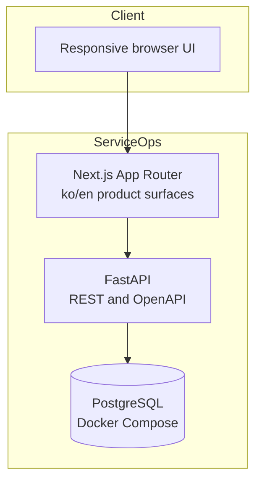

# Architecture

## Status

The implemented local product workflows and Milestone 5 portfolio polish are complete. PostgreSQL persists the booking domain, status history, and immutable organization-scoped audit events. Customer, staff, and owner APIs enforce role and organization scope; the database atomically rejects overlapping active bookings. Owner booking results expose server-side search, filters, schedule sorting, and bounded pagination. Responsive Korean/English product surfaces consume the live APIs, while critical role journeys, WCAG 2.1 AA axe checks, keyboard-dialog checks, reflow, forced-colors, reduced-motion, and touch-target geometry run through Playwright against an isolated temporary Docker stack. Public deployment remains provisional and unvalidated.

## Components



## Current request flows

The customer booking screen manages customer bookings. The staff surface lists only the signed-in staff member's assigned work and exposes valid state transitions. Owner operations provide live dashboard aggregation, booking list and month-calendar views, service management, assignment and note editing, status changes, customer and team directories, audit history, and safe CSV export. Interactive pages expose loading, empty, success, authorization, failure, and retry states.

The current booking request flow is:

```text
Browser → Next.js customer UI → FastAPI role/CSRF checks → availability service → PostgreSQL exclusion constraint → booking response → owner list
```

Operational changes use the same request boundary and append status history plus audit events in the booking transaction before returning the updated role-specific response.

Authentication follows a separate session boundary:

```text
Browser login → exact Origin check → Argon2id verification → PostgreSQL session hashes → HttpOnly access/refresh cookies + CSRF cookie
Authenticated write → access-session lookup → organization membership/role check → Origin + CSRF binding → domain transaction
Refresh → locked session row → rotate access, refresh, and CSRF credentials → revoke old credential hashes
```

FastAPI resolves the path organization and authenticated membership before protected queries run. A user outside the organization receives a non-revealing 404, a member with the wrong role receives 403, and customer booking reads add the authenticated customer UUID to the organization scope. UI route visibility is never an authorization boundary.

The dashboard endpoint aggregates a bounded 1–90 day interval ending today in the organization timezone. The owner booking list uses a stable `items`/`total`/`limit`/`offset` response with schedule sort order and organization-wide summary metrics. The calendar requests the visible month through the same owner-booking filters and accumulates every bounded API page before rendering a desktop month grid or mobile agenda, avoiding a second scheduling data model.

Weekly local availability is interpreted in the organization's IANA timezone. Persisted booking and time-off timestamps are timezone-aware and normalized by PostgreSQL. Slot responses carry UTC instants and the web renders them in `Asia/Seoul` for the demo organization.

Slot generation starts from active staff/service assignments and weekly availability, then subtracts time off, active bookings, and past intervals. Booking and rescheduling requests repeat those application checks for useful errors. A partial PostgreSQL GiST exclusion constraint on half-open `[start, end)` ranges is the final atomic authority; overlap violations become HTTP 409 `booking_conflict` responses, adjacent bookings remain valid, and cancelled bookings release their range.

Expected failures use the shared `{ "error": { "code", "message", "details?" } }` envelope documented in `docs/api.md`. Authentication, role/CSRF, hidden-resource, domain-conflict, and input-validation failures map consistently to 401, 403, 404, 409, and 422 responses. Web surfaces translate these into explicit authorization, validation, retry, empty, and failure states instead of interpreting transport errors as domain state.

## Boundaries

- `apps/web` owns rendering, localized navigation, interaction states, and accessible presentation.
- `apps/api` owns validation, authentication, authorization, business rules, slot calculation, and transaction boundaries.
- PostgreSQL owns relational constraints, persistence, and final atomic overlap protection.
- `packages/tokens` owns stable semantic visual tokens shared by web surfaces.
- Docker Compose is the reproducible local baseline; hosted services must not become required for tests.
- Playwright owns critical browser-flow and automated accessibility coverage. Each E2E run uses an independent Compose project, PostgreSQL volume, ports, API origin allow-list, and public API build URL, then removes the temporary resources on exit. API integration tests remain the authority for concurrency, tenancy, and business-rule edge cases.
- The provisional zero-cost public topology is Vercel Hobby for `apps/web` and `apps/api` plus Supabase Free for PostgreSQL only. It is not an implemented architecture until the deployment validation in ADR 005 passes.

## Health model

- `GET /health` is a liveness check and does not contact dependencies.
- `GET /ready` reports whether configuration and PostgreSQL connectivity can receive traffic.

## Decisions

See `docs/adr/` for the monorepo, design system, authentication, database tenancy, booking conflict, and provisional deployment decisions.
