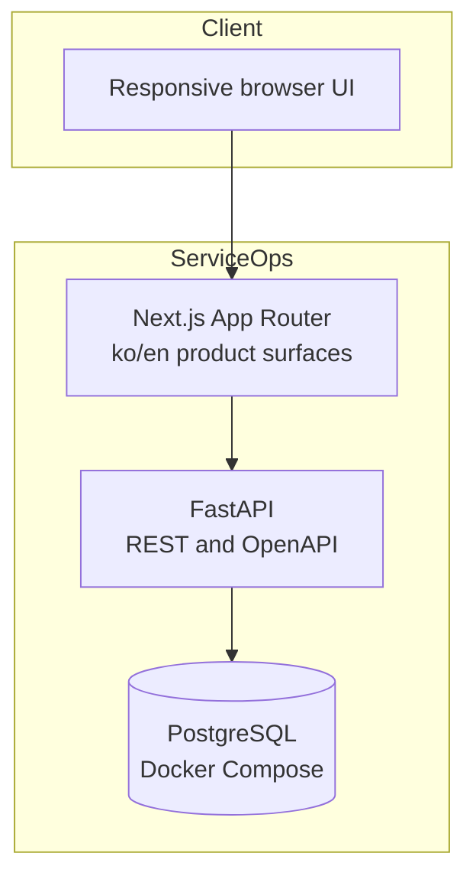

# Architecture

## Status

Milestone 3 is implemented. PostgreSQL persists the booking domain, status history, and immutable organization-scoped audit events. Customer, staff, and owner APIs enforce role and organization scope; the database atomically rejects overlapping active bookings.

## Components



## Current request flows

The customer booking screen manages customer bookings. The staff surface lists only the signed-in staff member's assigned work and exposes valid state transitions. Owner operations provide booking filters, assignment and note editing, status changes, customer and team directories, audit history, and safe CSV export. The dashboard remains the original fictional design-spike screen until Milestone 4.

The current booking request flow is:

```text
Browser → Next.js customer UI → FastAPI role/CSRF checks → availability service → PostgreSQL exclusion constraint → booking response → owner list
```

Operational changes use the same request boundary and append status history plus audit events in the booking transaction before returning the updated role-specific response.

Weekly local availability is interpreted in the organization's IANA timezone. Persisted booking and time-off timestamps are timezone-aware and normalized by PostgreSQL. Slot responses carry UTC instants and the web renders them in `Asia/Seoul` for the demo organization.

## Boundaries

- `apps/web` owns rendering, localized navigation, interaction states, and accessible presentation.
- `apps/api` owns validation, authentication, authorization, business rules, slot calculation, and transaction boundaries.
- PostgreSQL owns relational constraints, persistence, and final atomic overlap protection.
- `packages/tokens` owns stable semantic visual tokens shared by web surfaces.
- Docker Compose is the reproducible local baseline; hosted services must not become required for tests.

## Health model

- `GET /health` is a liveness check and does not contact dependencies.
- `GET /ready` reports whether configuration and PostgreSQL connectivity can receive traffic.

## Decisions

See `docs/adr/` for the monorepo, design system, authentication, database tenancy, booking conflict, and provisional deployment decisions.
