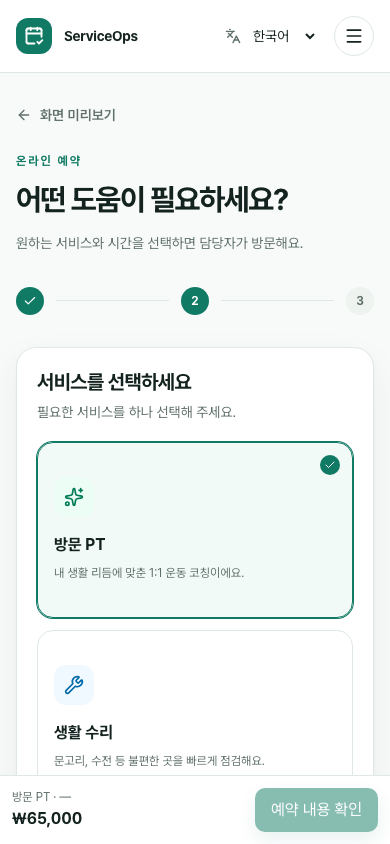
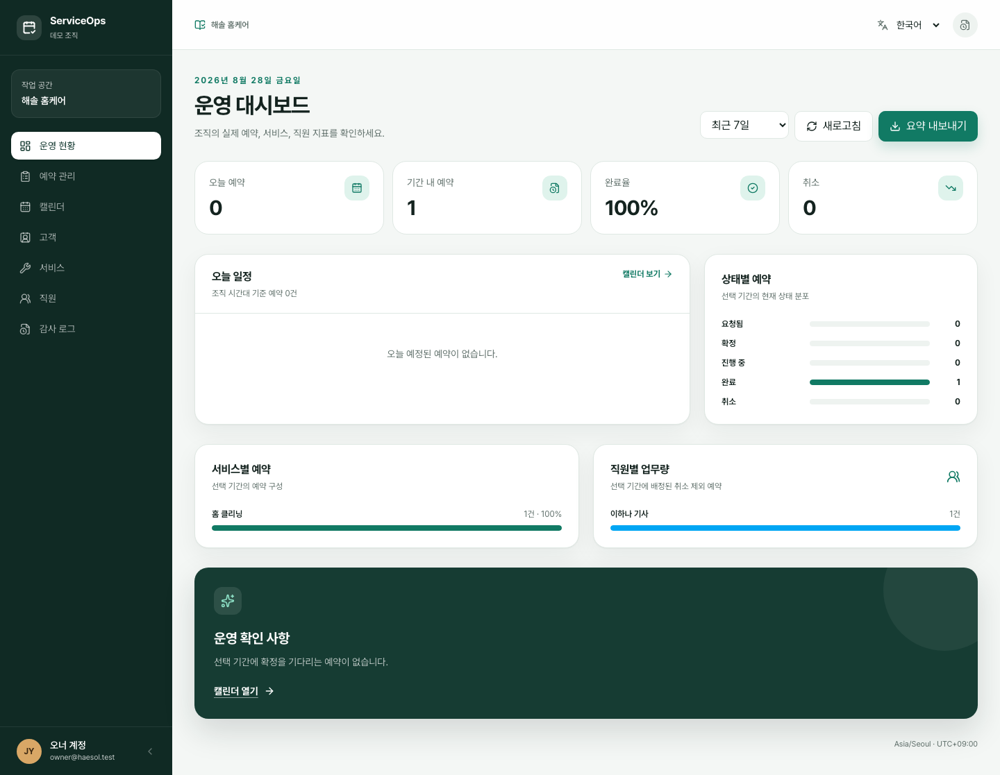
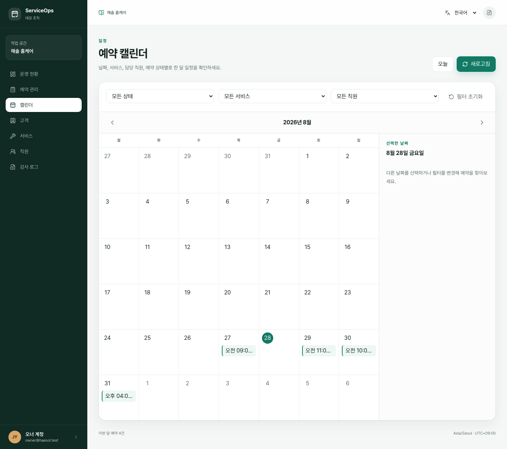
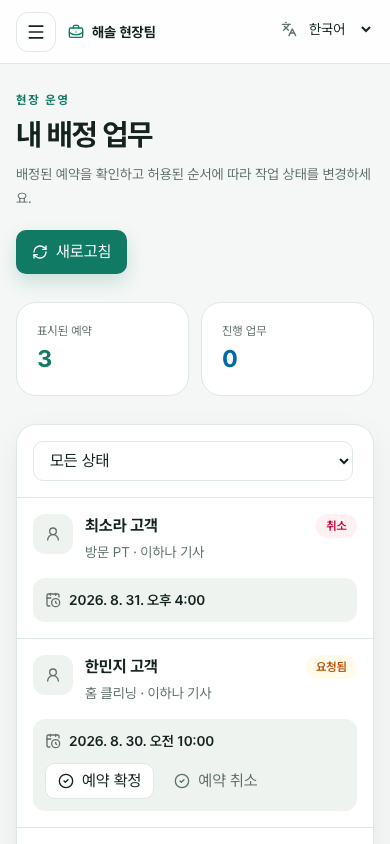

# ServiceOps case study

## The client-style problem

Small field-service teams often coordinate bookings through a mixture of phone calls, messages, personal calendars, and spreadsheets. Customers cannot see reliable availability, staff do not have one authoritative view of assigned work, and owners spend time reconciling status updates instead of managing service quality.

ServiceOps is a portfolio implementation of a focused replacement: one organization-scoped system where customers request available times, staff advance assigned work through valid states, and owners manage the schedule, catalog, people, reporting, and audit history.

## Requirements and constraints

The MVP needed to support customer, staff, and owner roles in Korean and English; generate bookable slots from weekly availability and time off; prevent overlapping active appointments; preserve customer privacy and internal notes; expose operational reports and CSV export; and remain reproducible on a developer laptop.

The project deliberately uses fictional `.test` identities and collects no payment. PostgreSQL and Docker Compose are the local baseline. External accounts, paid infrastructure, and deployment remain explicit approval decisions rather than hidden prerequisites.

## Architecture choice

The repository is a small monorepo containing one Next.js application, one FastAPI service, shared design tokens, documentation, and CI. Next.js owns localized presentation and interaction states. FastAPI is the authority for authentication, role and organization authorization, validation, booking rules, and transactions. PostgreSQL owns relational integrity and the final atomic booking-overlap guarantee.

Keeping the customer and operations experiences in one web application avoids duplicated foundations while two density profiles preserve their different needs: a comfortable mobile booking flow for customers and a compact information-rich workspace for staff and owners.

## Difficult implementation problems

### Conflict-safe availability

Showing an available slot is not enough because another request can arrive before the first customer submits. ServiceOps calculates slots from staff-service assignments, recurring availability, time off, and existing bookings, then uses a partial PostgreSQL GiST exclusion constraint as the final authority. Application validation produces useful errors; the database prevents the race condition.

### Authorization without accidental data exposure

Every organization query is scoped after authentication and membership resolution. Customer booking reads additionally include the customer user ID. Separate response schemas ensure `internal_note` never enters a customer response, and owner-only dashboard, export, assignment, and service-management operations are enforced by the API rather than UI visibility.

### Useful operations views without a second data model

The owner dashboard aggregates real booking data over a bounded organization-timezone period. The calendar reuses filtered booking responses and presents them as a desktop month grid or mobile agenda. This keeps list, calendar, and reporting behavior consistent while avoiding a parallel scheduling model.

### Reproducible browser testing

Critical browser flows create and mutate data, so running them against the normal development database caused persistent test records. `make e2e` now builds a separate Compose project with temporary ports and a disposable PostgreSQL volume, seeds it, runs the flows, and removes it on every exit path.

## Product views

| Customer booking                                                           | Owner dashboard                                                               |
| -------------------------------------------------------------------------- | ----------------------------------------------------------------------------- |
|  |  |

| Owner calendar                                                           | Staff assigned work                                                         |
| ------------------------------------------------------------------------ | --------------------------------------------------------------------------- |
|  |  |

The screenshots are generated from deterministic fictional seed data with `make portfolio-captures`.

## Testing strategy

Backend integration tests cover authentication, session rotation, CSRF, tenancy, role isolation, service operations, availability, cancellation and rescheduling, audit records, CSV sanitization, dashboard metrics, and near-concurrent booking attempts. Playwright covers the primary customer, staff, and owner journeys plus responsive English localization and authorization denial.

Automated axe checks target WCAG 2.0/2.1 A and AA rules across representative routes. Keyboard tests cover focus trapping, Escape dismissal, and focus restoration. Additional coverage checks 200%-equivalent reflow, reduced-motion behavior, forced colors, and horizontal overflow. A human screen-reader review remains required before the release tag.

## Security and privacy decisions

- Passwords use Argon2id, and browser sessions use rotating opaque access and refresh credentials stored in HttpOnly cookies.
- Only credential hashes are persisted; refresh and logout require CSRF binding and an exact origin allow-list.
- Login responses reduce account enumeration, and a local abuse limiter protects repeated failures.
- Organization and role scope are server-side requirements on every protected operation.
- CSV cells are sanitized against spreadsheet formula injection, and important mutations append audit events without credential or internal-note contents.
- Demo data is fictional and deterministic; real customer, card, and payment data are outside the project.

## Deliberate exclusions

The MVP excludes payments, invoicing, payroll, accounting, chat, AI features, native mobile apps, complex routing, recurring-booking automation, third-party OAuth, and SMS delivery. These features would add operational and compliance cost without improving the core portfolio story: reliable scheduling and role-aware service operations.

## Outcome and next phase

ServiceOps now demonstrates a complete local workflow: deterministic setup, secure sessions, organization-scoped APIs, conflict-safe booking, responsive bilingual role surfaces, live operations reporting, auditability, and automated quality gates. A clean checkout has been verified independently of the original working directory.

The next phase is a human assistive-technology review followed by an explicitly approved public deployment. Deployment must revalidate cookie, CORS, CSRF, and same-site behavior against the final domains and replace or supplement the process-local login limiter before multi-instance operation. After stable deployment screenshots and the acceptance checklist are confirmed, the repository can receive its first MVP release tag.
